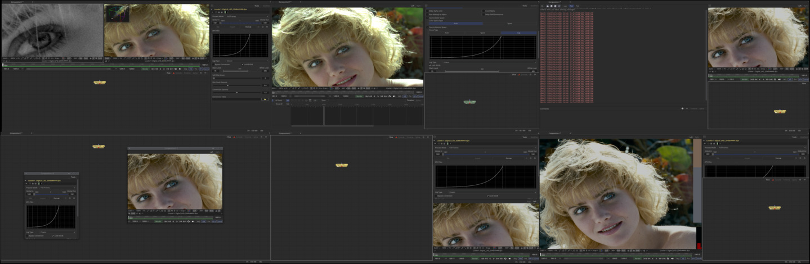
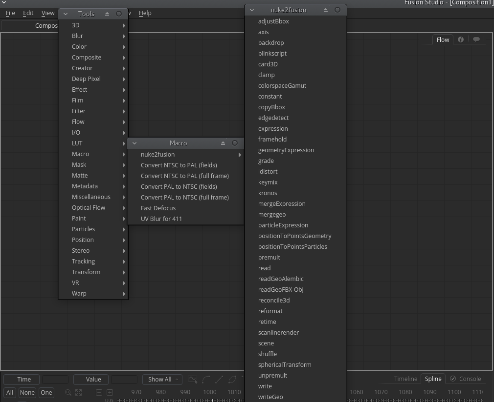

# nuke2fusion
A set of defaults for Fusion 9+ that makes transitioning from Nuke easier. 
Includes familiar Layouts from Nuke, a set of symlinked names/nodes for Nuke that creates Fusion equavalent nodes and hotkeys to mimic Nuke's default.

A work in progress, the community can help expand if needed.

## Layouts
The Layouts are inspired by the default workspaces in Nuke8+. The following layouts have been made :
* Animation
* Compositing
* Floating
* Large Node Graph
* Large Viewer
* Scripting

  

The layouts are stored in the Layout/ folder.

## Macros (gizmos)
* Nuke names to Fusion nodes are provided, but upon creation they change to the Fusion equavalent for future reference.
* Includes a few small snippets of nodes to showcase similar functionality (Position2Points, Reconcile3d etc)
* All accessible as Nuke names by pressing TAB and writing the name of the nodes.

  

The macros are stored in the macros/nuke2fusion/ folder.

## Hotkeys
A set of default hotkeys for creating nodes, toggling view controls on/off, disabling nodes and more. With a small addition of using capital 
letters to indicate 3d nodes.

* Tab for node search with wildcard (moved from shift-space)
* Lower case letters for 2d nodes (m)erge, (w)rite, (r)ead, (b)lur etc..
* Upper case letters for 3d nodes (M)erge3d, (R)enderer3d, (T)ransform3d etc..
* (d) for disable/passthrough node
* (q) (while focused on the viewer) disables/enables on-screen controls

The hotkeys can be configured and edited under the Config/fusion.fu file.

# Installation
Clone or copy the folders into your userprefs folder. 

If you havent set your userprefs yet, you can point to a place to store Fusion data pr.user 
* open Fusion
* File preferences
* Path map
* Select "UserPaths" and point it to your downloaded nuke2fusion folder.

# Notes
Fusion is very flexible, make sure you checkout all your option in the Preferences. Hopefully I'll add more sensible defaults there in the next round of nuke2fusion.
